<div align="center">
  
</div>

# Universal Video Cutter
Universal Video Cutter is a lightning-fast, sandboxed desktop application built to losslessly slice, compress, and transcode video files—including massive CCTV footage and complex multi-codec payloads.

Powered by a memory-safe **Rust (Tauri)** backend and a hardware-accelerated **FFmpeg** proxy generation engine, it provides butter-smooth scrubbing via a beautiful **SvelteKit** interface.

## Features

- **Format Agnostic:** Natively drops in almost any video format.
- **Dynamic Proxy Generation:** Instantly builds lightweight proxies for heavy formats that native browsers can't decode, enabling real-time timeline scrubbing.
- **Zero-Loss Fast Trimming:** The "Original (Fast Cut)" mode slices the video entirely within its container without touching the original encoding.
- **Universal Codec Export:** Re-encode on-the-fly to H.264, HEVC, or VP9 depending on your storage limits or playback target.
- **Automated Temp Cleanup:** Smart garbage collection wipes proxy droppings every 6 hours to protect SSD bloat.
- **Fully Responsive UI:** Glassmorphism, intelligent Dark/Light mode tracking, and gorgeous animations.

## Local Development

```bash
# 1. Download necessary FFmpeg sidecars
./download_ffmpeg.ps1

# 2. Install NodeJS frontend dependencies
npm install

# 3. Launch the Tauri developer instance
npm run tauri dev
```

## Build Release

```bash
# Produce the final Windows MSI/NSIS installers
npm run tauri build
```

## Acknowledgments & Licensing

> [!IMPORTANT]
> **FFmpeg**  
> This software uses code of [FFmpeg](https://ffmpeg.org) licensed under the **LGPLv2.1 / GPLv3** and its source can be downloaded from the official FFmpeg website. We do not own FFmpeg, nor do we claim any rights over it. FFmpeg is a trademark of Fabrice Bellard, originator of the FFmpeg project. All FFmpeg binaries utilized by this application are downloaded independently and are subject to their respective open-source licenses.

> [!NOTE]
> **Application License**  
> The source code of **Universal Video Cutter** itself is provided "as-is". For specific licensing details regarding this application, please refer to the `LICENSE` file in the root of this repository.
