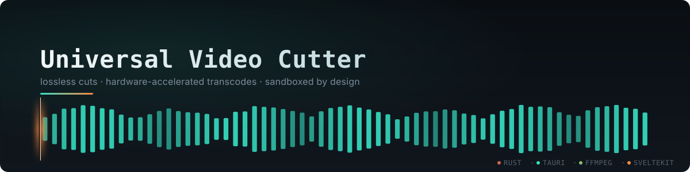

<div align="center">
  

  <br />

  [](https://github.com/im-ushan-ikshana/video_cutter/releases)
  [](LICENSE)
  [](https://github.com/im-ushan-ikshana/video_cutter)
  [](https://tauri.app)
  [](https://kit.svelte.dev)
  [](https://www.rust-lang.org)
</div>

# Universal Video Cutter

**Universal Video Cutter** is a lightning-fast, privacy-first desktop application built to losslessly slice, compress, and transcode video files—including massive surveillance footage (CCTV/DAV), raw bitstreams, and complex multi-codec payloads.

Powered by a memory-safe **Rust (Tauri v2)** backend and a hardware-accelerated **FFmpeg** proxy generation engine, it delivers butter-smooth timeline scrubbing and responsive editing inside an elegant **SvelteKit** interface.

---

## Key Features

- **Zero-Loss Fast Trimming:** Slice videos instantly in "Original (Fast Cut)" mode without re-encoding, preserving 100% of original visual and audio fidelity in seconds.
- **Universal Codec Export:** Re-encode on-the-fly to **H.264**, **HEVC (H.265)**, or **VP9** with customizable CRF quality targets, custom dimensions, and real-time progress indicators.
- **Opt-In Dynamic Proxy Engine:** Instantly generates lightweight `.mp4` proxies for heavy formats that native browsers cannot decode. Proxy generation is completely opt-in via Settings, giving you full control over CPU and disk usage.
- **Automated Temp & LRU Cache Manager:** Background disk manager keeps temporary proxies and thumbnails under a strict 2 GB budget with 7-day retention, accompanied by a one-click **Clear Cache** option in Settings.
- **Fullscreen HUD & Mini-Timeline:** Immersive fullscreen playback featuring a floating control dock, mini-timeline with scrub handles, and a 2.5-second idle auto-fade that activates strictly in fullscreen mode.
- **Trim Boundary Playback Looping:** Playback loop is constrained strictly between your active `In` and `Out` markers (`trimStart` to `trimEnd`) for seamless boundary inspection.
- **Project Sessions (`.cutterproj`):** Save and load edit sessions to preserve video source links and trim points across sessions.
- **Full-Window Drag & Drop:** Drop videos or project files directly onto the app window with a responsive, theme-aware drop overlay.
- **Refined Obsidian Aesthetics & Offline Typography:** Self-bundled offline Google Fonts (`Faculty Glyphic` across UI, `Modern Antiqua` for titlebar branding) with no remote CDN fetches. Includes an **Obsidian Dark** theme with warm amber/orange workstation accents, Modern Dark, and Studio Light modes.
- **Custom Desktop Titlebar & Home Navigation:** Native-feeling draggable titlebar with brand iconography and a dedicated **Home** navigation button to seamlessly return to the welcome screen.

---

## Supported Formats & Timeline Generation

Universal Video Cutter pairs a Chromium webview frontend with an FFmpeg backend. Format support is organized into two tiers: **Browser-Native** and **FFmpeg-Native**.

| Format Tier | Extensions (Examples) | Video Playback | Timeline View Generation | Proxy Required? | Description |
|---|---|---|---|---|---|
| **Browser-Native** | `.mp4`, `.webm`, `.ogg`, `.m4v` | ✅ Native (Instant) | ✅ Generated Instantly | No | Formats with codecs decoded natively by Chromium (H.264, VP8/VP9, AV1). They load immediately, and the timeline is generated in real-time via HTML5 Canvas. |
| **FFmpeg-Native** | `.mkv`, `.avi`, `.mov`, `.wmv`, `.flv`, `.ts`, `.mts`, `.m2ts`, `.vob`, `.rmvb`, `.asf`, `.3gp`, `.mpg`, `.dav`, `.mxf`, `.braw` | ❌ Requires Proxy | ❌ Fails if Proxy Disabled/Skipped | Yes (Configurable) | Formats supported by FFmpeg but not by Chromium webviews. When proxy generation is enabled in Settings, a lightweight `.mp4` proxy is generated for smooth preview and timeline extraction. If proxy generation is disabled, blind lossless cutting remains available. |
| **Raw Bitstreams** | `.h264`, `.h265`, `.hevc` | ❌ Requires Proxy | ❌ Fails if Proxy Disabled/Skipped | Yes (Configurable) | Raw video bitstreams lack container headers. Enabling proxy generation allows full preview, thumbnail timeline scrubbing, and lossless export. |

> [!NOTE]
> **Timeline Thumbnail Generation**:  
> Timeline thumbnails are generated in the browser via HTML5 Canvas (`thumbnails.ts`). If a video format cannot be decoded natively by the browser and proxy generation is turned off, frame extraction cannot occur. However, exact container cutting via FFmpeg stream copy remains fully operational.

---

## Keyboard Shortcuts

| Shortcut | Action | Description |
|---|---|---|
| <kbd>Space</kbd> | Play / Pause | Toggle video playback |
| <kbd>I</kbd> | Set In Point | Mark start of the trim section |
| <kbd>O</kbd> | Set Out Point | Mark end of the trim section |
| <kbd>←</kbd> / <kbd>→</kbd> | Frame Step | Step backward or forward by 1 frame |
| <kbd>Shift</kbd> + <kbd>←</kbd> / <kbd>→</kbd> | Jump 5s | Seek backward or forward by 5 seconds |
| Hold <kbd>←</kbd> / <kbd>→</kbd> | Rewind / Fast Forward | Smooth continuous scrubbing |
| <kbd>Ctrl</kbd> + <kbd>S</kbd> | Save Project | Save edit session as a `.cutterproj` file |
| <kbd>Ctrl</kbd> + <kbd>E</kbd> | Export Video | Open export dialog |

---

## Local Development

### Prerequisites

- [Node.js](https://nodejs.org/) (v20+ recommended)
- [Rust & Cargo](https://rustup.rs/) (Stable toolchain with `x86_64-pc-windows-msvc`)
- PowerShell 7+ or Windows PowerShell

### Getting Started

```powershell
# 1. Download required FFmpeg sidecars into src-tauri/bin/
.\download_ffmpeg.ps1

# 2. Install frontend dependencies
npm install

# 3. Launch the application in Tauri development mode
npm run tauri dev
```

---

## Building a Production Release

### Automated GitHub Actions Release

Pushing an annotated Git tag formatted as `v*.*.*` automatically triggers the Windows CI build pipeline defined in [`.github/workflows/release.yml`](.github/workflows/release.yml), compiling both MSI and NSIS standalone installers and publishing them to GitHub Releases.

```powershell
git tag -a v1.0.5 -m "Release v1.0.5"
git push origin v1.0.5
```

### Local Production Build

To compile standalone production bundles locally:

```powershell
# Build production installers (MSI / EXE)
npm run tauri build
```

Or run the interactive release script:

```powershell
.\local_release.ps1
```

---

## Acknowledgments & Licensing

> [!IMPORTANT]
> **FFmpeg**  
> This software utilizes [FFmpeg](https://ffmpeg.org) licensed under the **LGPLv2.1 / GPLv3**. FFmpeg source code can be downloaded from the official FFmpeg website. We do not own FFmpeg, nor do we claim any rights over it. FFmpeg is a trademark of Fabrice Bellard, originator of the FFmpeg project. All FFmpeg binaries utilized by this application are fetched independently and are subject to their respective open-source licenses.

> [!NOTE]
> **Application License**  
> The source code of **Universal Video Cutter** is licensed under the [MIT License](LICENSE).
